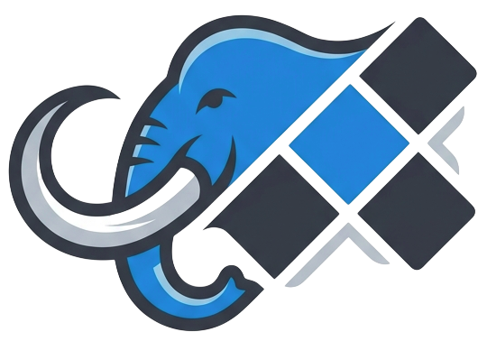

<h1 align="center">
  <br>MastoFetch
</h1>

<div align="center">

      [](https://ci.commitcloud.net/repos/16) 

[](https://www.buymeacoffee.com/RonDev)
[](https://ko-fi.com/U6U31EV2VS)
[](https://www.paypal.com/donate/?hosted_button_id=PWY939TPCQ3RA)
</div>
<hr>

MastoFetch ist ein leichtgewichtiges, ressourcensparendes und datenschutzkonformes Widget in Vanilla-PHP, um chronologische Feeds von mehreren Mastodon-Accounts zu aggregieren und in einer ansprechenden Masonry-Grid-Ansicht darzustellen. 

Die Anwendung arbeitet vollständig datenbankfrei, nutzt ein intelligentes dateibasiertes Caching und schützt die Privatsphäre der Endnutzer, indem Avatare und Medieninhalte über einen internen, gehärteten Proxy geladen werden, anstatt Daten direkt von externen Mastodon-Instanzen anzufragen.

## Features

- **Multi-Account Aggregation**: Kombiniert die Feeds verschiedener Mastodon-Profile chronologisch sortiert in einem Widget.
- **Datenbankfrei & Ressourcensparend**: Schnelles dateibasiertes JSON-Caching minimiert API-Requests zu den Instanzen.
- **Hocheffizienter Medien-Proxy**: Lokaler Download und Auslieferung von Avataren, Medienanhängen und Open-Graph-Vorschauen zum Schutz vor Nutzer-Tracking (Datenschutzkonform).
- **Link-Vorschau (Open Graph)**: Automatisches Scrapen von Link-Vorschauen bei Textbeiträgen ohne Bildanhang.
- **Erweiterte Sicherheit**:
  - Schutz vor Server-Side Request Forgery (SSRF) bei Medien-Downloads und Link-Scraping durch IP-Blacklisting (private/interne Netze).
  - Schutz vor Directory Traversal in der Proxy-Komponente via `realpath()`-Validierung.
  - Gehärtete API-Schnittstelle mit strikter Input-Validierung und Unterbindung von Information Disclosure bei Systemfehlern.
- **Themes**: `dark`, `light`, `mastodon`, `mastodon-dark`, `solarized`, `solarized-dark`, `nord`, `monokai`, `gruvbox`, `gruvbox-dark`, `neon-pulse`, `sunset-fade`, `hyper-lavender`, `mint-circuit`, `ember-dark`, `deep-ocean`, `cloudline`, `vaporwave` & `crimson-void`  

## Ordnerstruktur

Das Projekt folgt einer modularen, strikt getrennten Struktur:

```text
MastoFetch/
├── config/
│   └── accounts.json       # Zentrale Konfiguration der Accounts und Widgets
├── src/
│   ├── MastoAPI.php        # Kommunikation mit der Mastodon-API
│   └── MastoCache.php      # Cache-Logik, SSRF-Filterung und Datenverarbeitung
├── storage/
│   ├── data/               # JSON-Caches und ID-Zuordnungen
│   └── media/              # Lokal gespiegelte Avatare und Beitragsbilder
└── public/
    ├── assets/             # CSS & JS für Themes und Funktionen
    ├── .htaccess           # Zugriffsschutz für sensible Systembereiche
    ├── api.php             # Gehärtete API-Endpunkt für Widget-Daten
    ├── proxy.php           # Sicherer Medien-Proxy gegen Trackingschutz
    ├── index.php           # Dashboard zur Anzeige der Definierten Widgets
    └── widget.php          # Frontend-Ausgabe (HTML/CSS/JS Masonry Grid)
```

## Installation (Klassisches Hosting)

1. Kopiere den gesamten Ordner auf deinen Server.
2. Setze das Webroot deines Webservers strikt auf das Verzeichnis `public/`.
3. Stelle sicher, dass das Verzeichnis `storage/` für den Webserver beschreibbar ist (`chmod 755`).
4. Kopiere die `.env.example` zu `.env` und trage deine Mastodon API-Tokens ein.
5. Konfiguriere deine Accounts und Widgets in `config/accounts.json`.

## Voraussetzungen

- PHP 8.1 oder höher
- PHP-Erweiterungen: `curl`, `json`, `dom`, `libxml`
- Schreibrechte auf das Verzeichnis `storage/`

## Installation & Konfiguration

1. Klone das Repository in dein Webverzeichnis oder lade die Dateien auf deinen Server.
2. Stelle sicher, dass der Webserver Schreibrechte auf das Verzeichnis storage/ besitzt (`chmod -R 755 storage`).
3. Erstelle deine Konfigurationsdatei unter `config/accounts.json`.

## Beispiel für `config/accounts.json`

```
{
  "accounts": {
    "user1_main": {
      "instance": "mastodon.social",
      "username": "user1",
      "display_name": "User1 Main"
    },
    "tech_news": {
      "instance": "chaos.social",
      "username": "tech_feed",
      "display_name": "Tech Feed"
    }
  },
  "widgets": {
    "my_widget": {
      "title": "Mein Mastodon Feed",
      "accounts": ["user1_main", "tech_news"],
      "theme": "dark",
      "limit": 15,
      "cache_ttl": 900
    }
  }
}
``` 

## Beispiel für `.env`

```
# Mastodon API Access Tokens für die jeweiligen Instanzen
# Format: MASTO_TOKEN_[ACCOUNTNAME_MIT_UNTERSTRICHEN]
MASTO_TOKEN_USER1_MAIN=""
MASTO_TOKEN_TECH_NEWS=""
```

## Sicherheitshinweise
### Umgebungsvariablen (.env)

Falls du Zugriffstoken für private Instanzen oder geschützte APIs nutzt und diese in einer .env-Datei verwaltest, stelle sicher, dass diese Datei oberhalb des öffentlichen public/-Ordners liegt. Für Apache-Server liefert dieses Projekt standardmäßig eine restriktive public/.htaccess mit, die den direkten HTTP-Zugriff auf sensible Strukturen und Systemdateien komplett unterbindet.

### API-Abfragen

Die public/api.php steuert den Abruf der Daten serverseitig. Externe Anfragen können keinen erzwungenen Live-Refresh des Caches erzwingen. Dies schützt deine Anwendung und die kontaktierten Mastodon-Instanzen effektiv vor Denial-of-Service-Angriffen (DoS).

## Docker & Deployment

Dieses Projekt ist vollständig dockerfähig konzipiert. Die automatische Erstellung und Bereitstellung der Images erfolgt über GitHub-Workflows in der Registry:

```
ghcr.io/rondevhub/mastofetch:latest
```
Für den produktiven Betrieb wird der Container so konfiguriert, dass der `/public`-Ordner als Dokumenten-Root des Webservers fungiert, während `config/` und `storage/` als persistente Volumes gemountet werden können.

## Lizenz

Dieses Projekt ist Open-Source-Software. Die Weitergabe und Nutzung ist unter Einhaltung gängiger Open-Source-Standards erlaubt.

